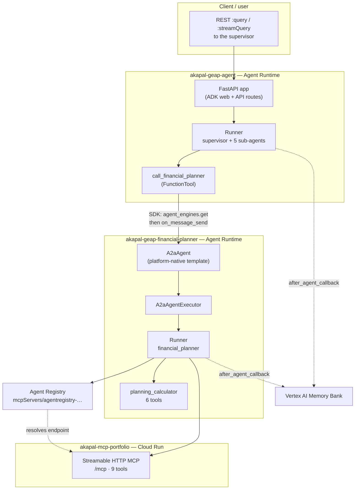

# Agent Runtime A2A — How GEAP Talks to the Financial Planner

This document explains how the supervisor reaches the financial planner now that
both run on **Agent Runtime**, why the design looks the way it does, and what
will bite you when you deploy it to a new project. It is written to be read
top-to-bottom by someone who has never touched A2A before.

> **Status (2026-09-18): the supervisor no longer serves A2A.** Its hand-written
> A2A server — `app/app_utils/a2a.py` and the routes it mounted at
> `/a2a/supervisor` — has been removed. The supervisor is now reached only
> through the Agent Runtime REST surface (`:query` / `:streamQuery`). Passages
> below that describe the supervisor *as an A2A server* are therefore
> historical. The outbound supervisor → planner hop, which is what this document
> is really about, is unchanged.

Companion docs:

- [`MEMORY_BANK.md`](./MEMORY_BANK.md) / [`LEARNING_MEMORY_BANK.md`](./LEARNING_MEMORY_BANK.md) — long-term memory
- [`TRANSFER_TOOL_NOT_FOUND.md`](./TRANSFER_TOOL_NOT_FOUND.md) — sub-agent transfer tooling

---

## 1. The 30-second version

There are two agents in two different repos, and they are deployed to two
different places:

```
supervisor  (Agent Runtime)  ──A2A──▶  financial_planner  (Agent Runtime)
                                              │
                                              ▼
                                       MCP portfolio  (Cloud Run)
```

The supervisor never imports planner code. It asks the planner a question over
the network, in the same way it would ask a colleague: it names the agent, sends
a sentence, and gets a sentence back. That is what A2A is — **a standard way for
one agent to ask another agent for help**, without either side knowing how the
other is built.

---

## 2. The one concept that matters: there are two kinds of A2A on Agent Runtime

This is the single most confusing thing in the whole setup, and getting it wrong
cost a previous attempt (the "Model B" migration) days. Agent Runtime can expose
an agent over A2A in **two completely different ways**:

|  | **App-served routes** | **Platform-native template** |
|---|---|---|
| What runs it | Your FastAPI app, mounted by `attach_a2a_routes()` | `vertexai.agent_engines.templates.a2a.A2aAgent` |
| Who owns the A2A surface | You | The platform |
| Public agent card | **Yes** — `.well-known/agent-card.json` | **No** — authenticated only |
| Card URL | `…/api/a2a/<name>/.well-known/agent-card.json` | `…/a2a/v1/card` (does not work today, see §9) |
| Transport | JSON-RPC | HTTP+JSON (REST) only |
| Deployed with | `agents-cli` | Agent Platform SDK object deploy |
| Used by | *(no longer used — the supervisor's surface has been removed)* | **the planner** |

Both are legitimately supported. The planner is deployed the second way (it
exists to *answer*). The supervisor *used* to be deployed the first way, so that
it could be *called*; that surface has been removed and the supervisor is now
reached over the platform's REST methods instead. It still reaches the planner
through the Agent Platform SDK, which speaks the platform-native surface.

> **Mental model:** the two agents are not wired together by configuration
> inside a shared process. They are two separate cloud services that happen to
> speak the same protocol. The only thing connecting them is one environment
> variable holding the planner's resource name.

---

## 3. Architecture



Three repos, three deployment shapes:

| Repo | What it is | Where it runs | Deployed by |
|---|---|---|---|
| `akapal-geap-agent` | supervisor + 5 sub-agents | Agent Runtime (REST) | `agents-cli deploy` |
| `akapal-geap-financial-planner` | planner + calculators | Agent Runtime (`A2aAgent`) | Agent Platform SDK |
| `akapal-mcp-portfolio` | portfolio data | Cloud Run | `gcloud run deploy` |

---

## 4. The pieces, one at a time

### 4.1 The agent card — a business card, not an API

A card is a small JSON document describing what an agent can do. It is the
*only* discovery mechanism A2A has.

The supervisor's own card went with its A2A surface, so the example below is the
**planner's** — which the platform generates and serves (authenticated) at
`{engine}/a2a/v1/card`. The supervisor's card used to look like this, with
`"name": "supervisor"` and a `…/api/a2a/supervisor` URL.

```json
{
  "name": "financial_planner",
  "description": "Goals-based financial planning: retirement readiness, …",
  "version": "1.0.0",
  "supportedInterfaces": [
    {
      "url": "https://us-central1-aiplatform.googleapis.com/v1beta1/projects/adk-tut-508714/locations/us-central1/reasoningEngines/6854616621567180800/a2a",
      "protocolBinding": "HTTP+JSON",
      "protocolVersion": "1.0"
    }
  ],
  "capabilities": { "streaming": false, "extendedAgentCard": true }
}
```

**The card advertises *skills*, never *tools*.** The supervisor's card listed 30
skills — one per tool, including its internal plumbing (`load_memory`,
`portfolio_service_unavailable`, …). A peer agent reading it cannot *call* any
of them. Function schemas never cross the wire in A2A. The only thing that
crosses is prose. That over-export is precisely why the planner hand-writes its
skills rather than letting `AgentCardBuilder` derive them.

> **Why this matters:** you cannot give another agent a "tool". You can only tell
> it what you are good at, and hope it asks. Everything downstream is natural
> language.

That is also why the planner's card skills are **hand-written** (see
`app/a2a_app.py`) rather than auto-derived: ADK's `AgentCardBuilder` would have
advertised its six calculator functions and MCP plumbing as skills, which tells a
peer's LLM nothing useful.

### 4.2 The operations — the fixed verbs of the platform's A2A surface

A platform-native A2A agent exposes exactly these operations, and nothing else:

| Operation | HTTP | Purpose |
|---|---|---|
| `on_message_send` | `POST {base}/v1/message:send` | send a question, get a task/message |
| `on_get_task` | `GET {base}/v1/tasks/{id}` | poll a task |
| `on_list_tasks` | `GET {base}/v1/tasks` | list tasks |
| `on_cancel_task` | `POST {base}/v1/tasks/{id}:cancel` | cancel |
| `on_get_extended_agent_card` | — | retrieve the card (returns 400 today, §9) |

where `{base}` is
`https://{region}-aiplatform.googleapis.com/v1beta1/{engine-resource}/a2a`.

You cannot mount your own routes on this surface. It is a fixed API, which is
exactly why the planner's Cloud Run web server is irrelevant to it.

### 4.3 The executor — the bridge from A2A to ADK

A2A speaks in tasks and messages. ADK speaks in runners and events. Something has
to translate, and that something is an `AgentExecutor`.

The planner uses ADK's built-in `A2aAgentExecutor`, which wraps a `Runner`:

```python
def build_agent_executor() -> A2aAgentExecutor:
    return A2aAgentExecutor(runner=build_runner)
```

`build_runner` is deliberately a **module-level, async** function, and both
words matter:

- **module-level** — the deployed object is pickled, and a module-level function
  is serialized *by reference*. A `lambda` is serialized by value and is fragile.
- **async** — the portfolio MCP toolset's `get_tools()` is async and cannot be
  awaited at import time. `A2aAgentExecutor` accepts
  `Callable[..., Runner | Awaitable[Runner]]` and awaits it on first use, so the
  toolset resolves inside the running event loop.

---

## 5. A real request, end to end

Here is an actual verified run. The caller sends one sentence; the answer comes
back with live portfolio numbers.

**Step 1 — the caller asks the supervisor.** A REST call to the engine's
`:streamQuery` method. This run predates the A2A removal, so the transcript still
shows the JSON-RPC form the supervisor used to accept:

```json
POST https://us-central1-aiplatform.googleapis.com/reasoningEngines/v1/projects/238721448932/locations/us-central1/reasoningEngines/5324518648168054784/api/a2a/supervisor
{
  "jsonrpc": "2.0", "id": 1, "method": "SendMessage",
  "params": { "message": {
    "role": "ROLE_USER", "messageId": "e2e-1",
    "parts": [{ "text": "Can I retire in 10 years if I save $1,000/month?" }]
  }}
}
```

**Step 2 — the supervisor's LLM decides.** Its prompt says financial-planning
questions "MUST be delegated to the `call_financial_planner` tool". The model
therefore emits a function call rather than answering itself.

**Step 3 — the tool reaches across.** `call_financial_planner` resolves the
planner engine by resource name and sends the same sentence through the Agent
Platform SDK:

```python
remote = _client().agent_engines.get(name=_planner_engine())
chunks = await remote.on_message_send(
    request=SendMessageRequest(message=Message(..., parts=[Part(text=request)]))
)
```

`FINANCIAL_PLANNER_ENGINE` is the only thing naming the planner:

```
projects/adk-tut-508714/locations/us-central1/reasoningEngines/6854616621567180800
```

**Step 4 — the planner runs.** Its executor starts the ADK runner, the planner
LLM resolves the Agent Registry entry for the MCP server, calls the portfolio
tools, and computes the projection with `planning_calculator`.

**Step 5 — the answer comes back.** The supervisor relays it:

> Based on your current account summary, your total value is **$238,846.12**.
>
> - **Projected Balance at Retirement (Age 50):** **$654,094.29**
> - **Monthly Withdrawal in Retirement:** $2,176.95 (4% rule)
> - **Sustainability:** projected to last beyond life expectancy
>
> _Assumptions: current age 40, 7% annual return, life expectancy 85._

Those numbers are the proof the chain is real: `$238,846.12` can only come from
the live MCP portfolio server, and `$654,094.29` only from the planner's
calculator.

---

## 6. Deploying it — order matters

The dependency is a chain, so the deploy order is forced. Each step prints the
value the next step needs.

```
1. MCP portfolio    → prints the Cloud Run URL + registers in Agent Registry
2. Planner          → prints the engine resource name
3. Supervisor       → consumes the planner's resource name
```

| Step | Repo | Command |
|---|---|---|
| 1 | `akapal-mcp-portfolio` | `./build.personal.sh` then `./deploy.personal.sh` |
| 2 | `akapal-geap-financial-planner` | `./deploy.personal.a2a.sh` |
| 3 | `akapal-geap-agent` | `./build.personal.sh` then `./deploy.personal.sh` |

Then wire the printed values into the env files:

| Value | Lives in |
|---|---|
| `MCP_PORTFOLIO_URL` | both agent repos' `deploy.personal.env` |
| `MCP_REGISTRY_SERVER` | both agent repos' `deploy.personal.env` |
| `FINANCIAL_PLANNER_ENGINE` | `akapal-geap-agent/deploy.personal.env` |

> **Run the supervisor's deploy twice on a fresh engine.** `agents-cli` only
> sets `APP_URL` from an *existing* engine's resource name, so a first-time
> `create` leaves the card advertising `http://0.0.0.0:8000/a2a/supervisor`.
> The second deploy corrects it. See §9.

---

## 7. Prerequisites on a new project

Beyond the obvious `aiplatform` / `run` / `artifactregistry` / `cloudbuild`
APIs, a fresh project needs:

**Two more APIs**

```bash
gcloud services enable agentregistry.googleapis.com cloudresourcemanager.googleapis.com
```

- `agentregistry` — the planner resolves the MCP endpoint from it.
- `cloudresourcemanager` — Vertex AI's initializer needs it to resolve project
  numbers; without it you get noisy `Failed to convert project number to project
  ID` tracebacks (non-fatal, but they hide real errors).

**A staging bucket** — required by the SDK object deploy:

```bash
gcloud storage buckets create gs://geap-staging-238721448932 \
  --project=adk-tut-508714 --location=us-central1 --uniform-bucket-level-access
```

**Two IAM grants** to the Agent Runtime service account
(`service-<PROJECT_NUMBER>@gcp-sa-aiplatform-re.iam.gserviceaccount.com`):

| Role | Why |
|---|---|
| `roles/agentregistry.viewer` | the planner reads its MCP server entry **at import time** |
| `roles/aiplatform.user` | the supervisor calls the planner's engine |

```bash
gcloud projects add-iam-policy-binding adk-tut-508714 \
  --member="serviceAccount:service-238721448932@gcp-sa-aiplatform-re.iam.gserviceaccount.com" \
  --role="roles/agentregistry.viewer" --condition=None
gcloud projects add-iam-policy-binding adk-tut-508714 \
  --member="serviceAccount:service-238721448932@gcp-sa-aiplatform-re.iam.gserviceaccount.com" \
  --role="roles/aiplatform.user" --condition=None
```

> IAM grants take a minute or two to propagate. A `403` immediately after a grant
> is usually just latency — retry before debugging.

---

## 8. What lives where

**`akapal-geap-financial-planner`**

| File | Role |
|---|---|
| `app/a2a_app.py` | the `A2aAgent`: hand-written card + executor factory |
| `deploy_a2a.py` | SDK object deploy (`create(agent=a2a_agent, …)`) |
| `deploy.a2a.sh` / `deploy.personal.a2a.sh` | env-driven wrappers |
| `app/fast_api_app.py` | **unchanged** — still the Cloud Run path |

**`akapal-geap-agent`**

| File | Role |
|---|---|
| `app/tools/a2a_planner_tool.py` | `call_financial_planner`, now SDK-based |
| `deploy.personal.env` | `FINANCIAL_PLANNER_ENGINE` and the MCP values |

> `app/app_utils/a2a.py` — the supervisor's inbound A2A surface — has been
> **removed** (see the status note at the top). `app/fast_api_app.py` now wires
> the shared session/artifact/memory services directly instead.

---

## 9. Troubleshooting — real failures from this build

Every entry below was hit for real while deploying to a fresh project.

### `No module named 'app.a2a_app'` — the container dies on startup

```
UserCodeControlPlaneError: Control plane operation failed due to user code:
No module named 'app.a2a_app'
```

**Cause:** the SDK object deploy ships only the pickle and the requirements file.
Your source package is not included, so the pickled references to `build_runner`
and `build_agent_executor` cannot be resolved.

**Fix:** bundle the package explicitly.

```python
config={..., "extra_packages": ["app"]}
```

### `Please provide a staging_bucket`

**Cause:** `config.staging_bucket` is mandatory for the object deploy and has no
default.

**Fix:** create a bucket and pass `"staging_bucket": "gs://…"`.

### `Permission 'agentregistry.mcpServers.get' denied` — engine won't start

**Cause:** the planner builds its MCP toolset at *import* time, so registry access
is a startup dependency. The runtime SA lacks the permission.

**Fix:** grant `roles/agentregistry.viewer` to the Agent Runtime SA.

### `Permission 'aiplatform.reasoningEngines.get' denied` — planner call fails

**Cause:** the supervisor's SA cannot see the planner's engine.

**Fix:** grant `roles/aiplatform.user`. (This is the same fix documented in
`SESSION_HANDOFF.md` from the earlier deployment.)

### `403 Forbidden` on `…/a2a/message:send`

**Cause:** almost always IAM propagation latency right after granting
`roles/aiplatform.user`.

**Fix:** wait ~90 seconds and retry.

### `handle_authenticated_agent_card` does not exist

The GEAP docs show that method on the SDK object; it is not present in the pinned
version. The registered operation is `on_get_extended_agent_card`, and the raw
`{base}/v1/card` path 404s.

> **Superseded (2026-09-18):** the planner's card *is* retrievable — it is stored
> inline in the Agent Registry `Agent` resource as `card.content` (type
> `A2A_AGENT_CARD`), with its three skills indexed. It is simply not served at a
> public `.well-known` path. This never affected the supervisor, which uses
> `on_message_send`.

### `ruff check` / `ruff format` fail and block the deploy

`agents-cli lint` runs both across the **whole repo**. Note that `ruff format`
also reformats Python code blocks embedded in `.md` files.

---

## 10. Current state

| Piece | Identifier |
|---|---|
| Project | `adk-tut-508714` (number `238721448932`), `us-central1` |
| MCP portfolio | `https://mcp-portfolio-238721448932.us-central1.run.app` |
| MCP registry entry | `projects/adk-tut-508714/locations/us-central1/mcpServers/agentregistry-00000000-0000-0000-bd9d-1747fbf2c9c1` |
| Planner engine | `…/reasoningEngines/6854616621567180800` |
| Supervisor engine | `…/reasoningEngines/5324518648168054784` |
| Staging bucket | `gs://geap-staging-238721448932` |

---

## 11. Glossary

| Term | Meaning |
|---|---|
| **A2A** | Agent2Agent — a standard protocol for one agent to ask another for help. |
| **Agent card** | A JSON business card: name, description, skills, and where to send messages. |
| **Agent Runtime** | The part of GEAP that hosts agents. Formerly Vertex AI Agent Engine / Reasoning Engine. |
| **Engine** | One deployed agent. Named `projects/<p>/locations/<l>/reasoningEngines/<id>`. |
| **GEAP** | Gemini Enterprise Agent Platform — the umbrella product (Vertex AI rebranded). |
| **GEAP vs Agent Runtime** | GEAP is the platform; Agent Runtime is the hosting layer inside it. |
| **`A2aAgent`** | The SDK template that turns your agent into a platform-native A2A service. |
| **`AgentExecutor`** | The adapter between A2A's task/message world and ADK's runner/event world. |
| **Operation** | One verb on the platform A2A surface, e.g. `on_message_send`. |
| **`on_message_send`** | The operation that sends a question. Takes `request=`, returns a list of chunks. |
| **Skill** | An advertised capability on a card. A description, never a callable function. |
| **Object deploy** | `client.agent_engines.create(agent=<pickled object>)`. What the planner uses. |
| **Agent Registry** | GCP service that publishes/discoveres MCP servers. The planner resolves its MCP endpoint from it. |
| **MCP** | Model Context Protocol — how the planner reaches portfolio data. |
