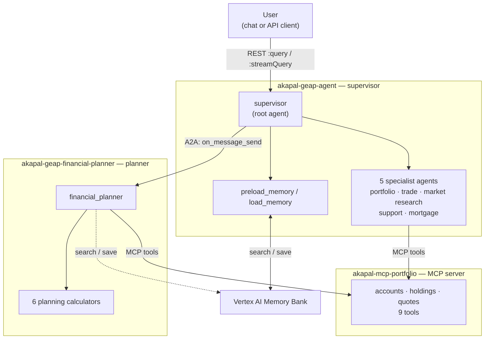
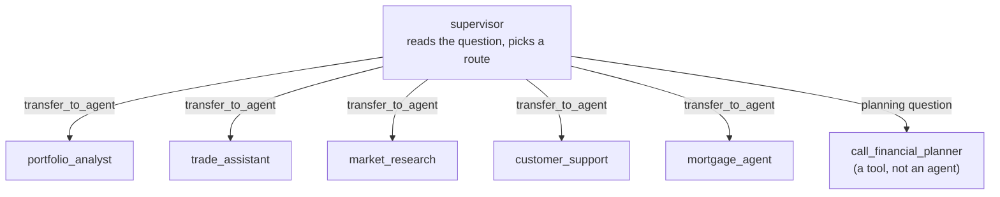
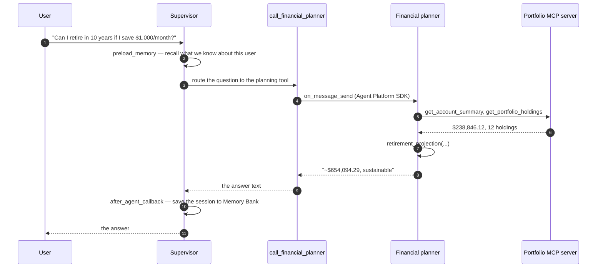

# Architecture — How the Assistant Answers a Question

This page explains the whole system in plain language: who the players are, how a
question travels through them, and why it is built this way.

Read this first. The other docs go deeper on single parts, and are linked at the
bottom.

---

## 1. What the system does

A user asks a financial question in chat:

> "Can I retire in 10 years if I save $1,000 a month?"

The system answers with real numbers taken from that user's own accounts:

> Based on your current account summary, your total value is **$238,846.12**.
> Projected balance at retirement (age 50): **$654,094.29**.

That takes more than one brain. It needs someone to talk to the user, someone to
do the maths, and something that knows the account balances. Those are three
different services in three different repos.

---

## 2. The players

| Player | Where it runs | What it does |
|---|---|---|
| **Supervisor** | Agent Runtime | The front door. Talks to the user and decides who should answer. |
| **5 specialist agents** | inside the supervisor | Portfolio, trading, market research, customer support, mortgage. |
| **Financial planner** | Agent Runtime (its own service) | Retirement, savings and affordability maths. |
| **Portfolio MCP server** | Cloud Run | Holds the account, holdings and quote data. |
| **Memory Bank** | Vertex AI | Remembers the user between conversations. |

Two of these are *agents we wrote*. The other two are *services we call*.

---

## 3. Why it looks like this (first principles)

Forget the product names. Start from what any assistant must do, and the design
falls out of the answers.

**1. A user needs one place to talk to.**
So there is one supervisor. It is the only thing the user ever addresses.

**2. Different questions need different skills.**
"Should I rebalance?" and "Is my mortgage affordable?" are not the same job. So
the supervisor hands work to specialists instead of doing everything itself.

**3. The account data does not live in the agent.**
Balances change constantly and belong to a system of record. So the data sits
behind its own server, and the agents *ask* for it. That is what MCP is: one
agreed way for an agent to call a data server.

**4. Users should not have to repeat themselves.**
"If I told you last week I'm conservative, why are you asking again?" So every
turn searches a memory store for relevant past facts, and every turn saves what
it learned.

**5. The planner is a separate product.**
It has its own prompt, its own maths tools, its own release cycle. Bundling it
into the supervisor would mean redeploying the whole assistant to fix one
formula. So it is deployed as its own service, and the supervisor calls it over
the network.

That last point is the key one: **the supervisor never imports planner code.** The
two services share a protocol, not a codebase.

---

## 4. The big picture

Both agents run on **Agent Runtime**. That is the part of Google Cloud that
hosts agents. Neither repo writes or runs an HTTP server — we hand the platform a
Python object and the platform serves it.

---

## 5. Inside the supervisor

The supervisor is one agent with five sub-agents and one tool.

Two things are worth noticing:

- **The sub-agents are not separate services.** They are agents in the same
  process. Handing work to one is just a function call, not a network hop.
- **The planner is not a sub-agent.** It is a tool. The supervisor calls it the
  way it would call a calculator, and the call happens to cross the network.

Each specialist carries the portfolio MCP tools so it can look up real holdings
while it works.

---

## 6. One question, step by step

Take the retirement question again, and follow it all the way through.

Two details that explain a lot of the code:

- **The planner is stateless.** Every call gets a fresh message and task, so two
  planning questions do not see each other. That is deliberate.
- **The supervisor passes a sentence, not a structured call.** A2A carries prose,
  never function schemas. The planner decides how to read the request.

---

## 7. Where the code lives

**Supervisor repo — `akapal-geap-agent`**

| File | Role |
|---|---|
| `app/agent.py` | Entry point. Exposes `root_agent`; loads `.env` and telemetry. |
| `app/agents/supervisor.py` | The supervisor: sub-agents, memory tools, planner tool. |
| `app/agents/*.py` | The five specialists. |
| `app/tools/a2a_planner_tool.py` | The network call to the planner. |
| `app/app_utils/api_registry_mcp.py` | Builds the portfolio MCP toolset. |
| `app/app_utils/resilient_mcp.py` | Keeps a dead MCP server from killing a turn. |
| `app/app_utils/memory_callbacks.py` | Saves each session to Memory Bank. |
| `app/config/models.py` | Model choice and retry settings. |
| `deploy_adk.py` | Deploys the supervisor. |

**Planner repo — `akapal-geap-financial-planner`**

| File | Role |
|---|---|
| `app/a2a_app.py` | The `A2aAgent`: card, executor, runner. |
| `app/agents/financial_planner_agent.py` | The planner agent itself. |
| `app/tools/planning_calculator.py` | The six maths tools. |
| `app/app_utils/api_registry_mcp.py` | Builds the portfolio MCP toolset. |
| `app/app_utils/services.py` | Session, artifact and memory services. |
| `deploy_a2a.py` | Deploys the planner. |

---

## 8. When something is broken

The system is built so one dead dependency degrades the answer instead of
crashing the turn.

| What is down | What the user sees |
|---|---|
| Portfolio MCP server | The agent says portfolio data is temporarily unavailable and asks them to retry. It does **not** invent numbers. |
| Financial planner | The supervisor relays a plain "the planner could not answer" message. |
| Nothing configured | The agents warn at startup and answer without live portfolio data. |

The MCP path also has a short cooldown, so a dead server is not retried on every
single turn.

---

## 9. Read next

- [`AGENT_RUNTIME_A2A.md`](./AGENT_RUNTIME_A2A.md) — the supervisor → planner hop
  in detail: the protocol, the deploy order, the IAM, and the failures to expect.
- [`AGENT_RUNTIME_A2A_APPROACHES.md`](./AGENT_RUNTIME_A2A_APPROACHES.md) — why
  these are deployed as objects instead of containers, and what that costs.
- [`MEMORY_BANK.md`](./MEMORY_BANK.md) — how long-term memory works.
- [`LEARNING_MEMORY_BANK.md`](./LEARNING_MEMORY_BANK.md) — a gentler walkthrough of the same.
- [`TRANSFER_TOOL_NOT_FOUND.md`](./TRANSFER_TOOL_NOT_FOUND.md) — how sub-agent
  hand-off actually works in ADK.
