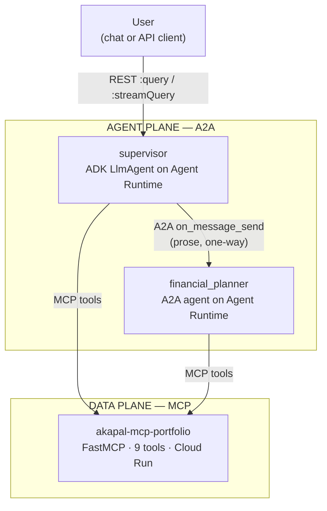
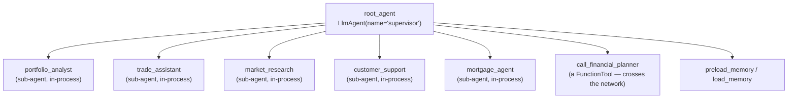
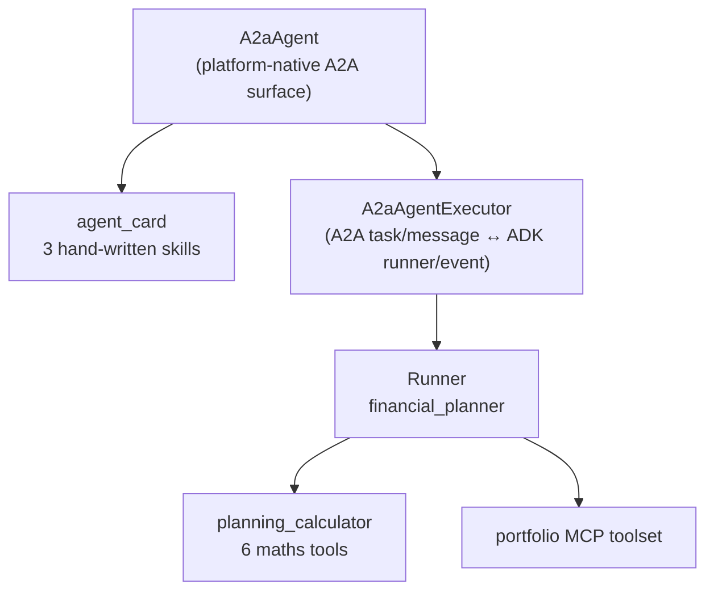
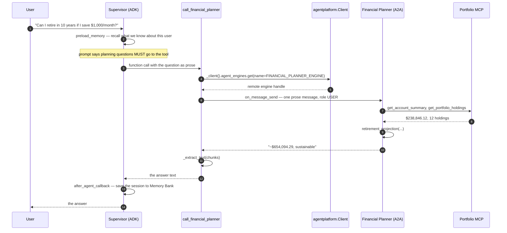
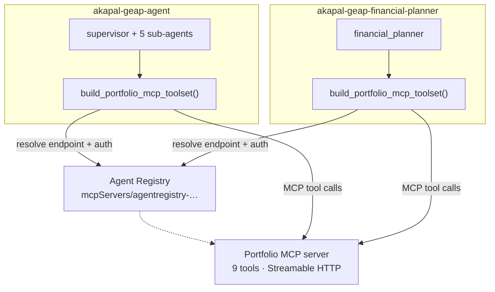
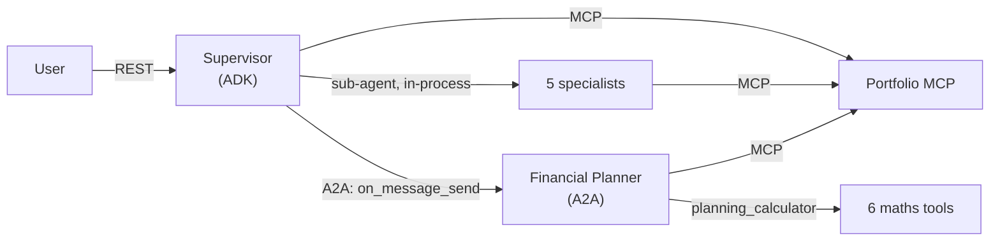
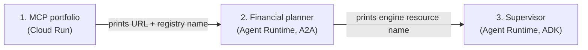

# Demo Walkthrough — Supervisor, Financial Planner, and the Portfolio MCP

This document is a **demo script with receipts**. Every claim below is backed by
a file path and line numbers you can open live. It covers exactly four claims:

1. The **Supervisor** is an ADK agent.
2. The **Financial Planner** is an A2A agent.
3. The Supervisor **calls** the Financial Planner — how they find each other and
   what actually crosses the wire.
4. Both agents use the **portfolio MCP server** — how each discovers it and how
   it is messaged.

The one thing to hold onto: **there are two independent planes.**

| Plane | Between | Protocol | Who knows whom |
|---|---|---|---|
| **Agent plane** | Supervisor → Financial Planner | A2A | Supervisor knows the planner by resource name. The planner does not know the supervisor at all. |
| **Data plane** | Supervisor → Portfolio · Planner → Portfolio | MCP | Both agents discover the *data server* through Agent Registry. Neither agent discovers the *other* agent through MCP. |

Everything below is the proof, plane by plane.

---

## 0. The one-slide mental model



The supervisor and the planner are **two separate cloud services that happen to
speak the same protocol**. They share an environment variable, not a codebase.

---

## 1. Claim: the Supervisor is an ADK agent

**Repo:** `akapal-geap-agent`

### The proof

The supervisor is a `google.adk.agents.LlmAgent`:

```python
# app/agents/supervisor.py
from google.adk.agents import LlmAgent                     # line 1
...
root_agent = LlmAgent(                                      # line 14
    name="supervisor",
    model=build_model(),
    instruction=SUPERVISOR_PROMPT,
    sub_agents=[portfolio_agent, trade_agent, market_research_agent,
                support_agent, mortgage_agent],             # lines 18-24
    tools=[financial_planner_tool, preload_memory, load_memory],  # lines 25-29
    after_agent_callback=save_session_to_memory_callback,   # line 30
)
```

`root_agent` is the name ADK's loader and the runtime both look for:

```python
# app/agent.py
from app.agents.supervisor import root_agent               # line 12
__all__ = ["root_agent"]                                    # line 18
```

It is deployed as an **ADK object**, and the platform serves the operations —
there is no FastAPI app, no uvicorn, no Dockerfile to own:

```python
# deploy_adk.py
from agentplatform.agent_engines import AdkApp              # line 23
...
app = AdkApp(agent=root_agent)                              # line 116
remote = client.agent_engines.update(name=matches[0], agent=app, config=CONFIG)  # line 120
# or: client.agent_engines.create(agent=app, config=CONFIG)                     # line 138
print(f":query        POST {base}:query")                   # line 145
print(f":streamQuery  POST {base}:streamQuery")             # line 146
```

### What "ADK agent" means here, concretely



- The **5 sub-agents are not services.** They are agents in the same process; a
  hand-off is a function call, not a network hop.
- The **planner is not a sub-agent.** It is a *tool* — the supervisor calls it
  the way it would call a calculator, and that call happens to cross the network.

**Say this out loud:** "The supervisor is one process. Its specialists are inside
it. The only thing it reaches over the network is the planner and the data."

---

## 2. Claim: the Financial Planner is an A2A agent

**Repo:** `akapal-geap-financial-planner` (a separate repository)

### The proof

The planner is built on the platform-native A2A template:

```python
# app/a2a_app.py
from agentplatform.agent_engines.templates.a2a import A2aAgent, create_agent_card  # line 16
...
a2a_agent = A2aAgent(                                       # line 108
    agent_card=create_agent_card(
        agent_name="financial_planner",
        description=("Goals-based financial planning: retirement readiness, "
                     "savings targets, cash flow, and affordability projections."),
        skills=_SKILLS,
    ),
    agent_executor_builder=build_agent_executor,            # line 117
)
a2a_agent.set_up()                                          # line 125
```

The executor is the A2A ↔ ADK bridge:

```python
# app/a2a_app.py
def build_agent_executor() -> A2aAgentExecutor:             # line 103
    return A2aAgentExecutor(runner=build_runner)            # line 105
```

Deployment auto-detects the framework as **`a2a`**, which is what registers the
A2A operations, and exposes the card:

```python
# deploy_a2a.py
remote = client.agent_engines.create(agent=a2a_agent, config=CONFIG)   # line 155
a2a_base = f"https://{REGION}-aiplatform.googleapis.com/v1beta1/{resource_name}/a2a"  # line 159
print(f"A2A card    : {a2a_base}/v1/card")                             # line 163
```

### The card advertises *skills*, never *tools*

```python
# app/a2a_app.py — hand-written on purpose (lines 30-65)
_SKILLS = [
    AgentSkill(id="retirement_readiness", name="Retirement readiness", ...),
    AgentSkill(id="savings_goal",         name="Savings goal projection", ...),
    AgentSkill(id="cash_flow",            name="Cash-flow and affordability", ...),
]
```

ADK's `AgentCardBuilder` would have advertised internal plumbing
(`load_memory`, `portfolio_service_unavailable`, …) as skills, which tells a
peer's LLM nothing useful. So they are written by hand to be read.

**A2A has no discovery mechanism other than the card.** You cannot give another
agent a "tool". You can only tell it what you are good at, and hope it asks.
Everything downstream is natural language.

### The nuance management will ask about

**A2A is the planner's *exposure*, not its *engine*.** Internally it is still an
ADK `LlmAgent`:

```python
# app/agents/financial_planner_agent.py
return LlmAgent(                                            # line 47
    name="financial_planner",
    model=build_model(),
    instruction=PLANNER_PROMPT,
    tools=tools + [preload_memory, load_memory],            # line 55
    after_agent_callback=save_session_to_memory_callback,   # line 56
)
```



- **Supervisor:** ADK exposure, no A2A surface of its own (its inbound A2A was
  removed — see the status note at the top of `docs/AGENT_RUNTIME_A2A.md`).
- **Planner:** A2A exposure, ADK engine underneath.

They are mirror images.

---

## 3. Claim: the Supervisor calls the Financial Planner

### 3a. How they find each other (the contact)

The **only** coupling is one environment variable holding a resource name:

```bash
# akapal-geap-agent/geap.deploy.env:53 (and deploy.personal.env:50)
export FINANCIAL_PLANNER_ENGINE="projects/${PROJECT_ID}/locations/${REGION}/reasoningEngines/<id>"
```

```python
# app/tools/a2a_planner_tool.py
DEFAULT_PLANNER_ENGINE = "projects/PLACEHOLDER/locations/us-central1/reasoningEngines/PLACEHOLDER"  # 32-34
def _planner_engine() -> str:                               # line 42
    return os.environ.get("FINANCIAL_PLANNER_ENGINE", DEFAULT_PLANNER_ENGINE).strip()  # line 44
```

No shared code, no URL plumbing, no card fetch. The placeholder fails loudly on
first use until the real value is set.

### 3b. Why the supervisor chooses to call it

The prompt forces the routing decision:

```python
# app/prompts/supervisor_prompt.py (lines 12-16)
# Financial planning questions — retirement readiness, savings goals,
# cash-flow, affordability, "can I retire in N years if I save X/month" —
# MUST be delegated to the call_financial_planner tool. Never answer them
# yourself and never route them to any other sub-agent.
```

So the model emits a **function call** rather than answering itself.

### 3c. What actually crosses the wire (the communication)

All of it lives in `app/tools/a2a_planner_tool.py`:

```python
# 1. A cached, process-wide client (auth + TLS are expensive) — lines 47-67
@functools.cache
def _client() -> agentplatform.Client:
    return agentplatform.Client(
        project=os.environ["GOOGLE_CLOUD_PROJECT"],
        location=(os.environ.get("GOOGLE_CLOUD_AGENT_ENGINE_LOCATION")
                  or os.environ.get("GOOGLE_CLOUD_LOCATION") or "us-central1"),
        http_options=types.HttpOptions(api_version="v1beta1", timeout=_PLANNER_TIMEOUT_MS),
    )

# 2. Resolve the engine by resource name, then send one message — lines 96-105
remote = _client().agent_engines.get(name=_planner_engine())
chunks = await remote.on_message_send(
    request=SendMessageRequest(
        message=Message(
            message_id=f"supervisor-{uuid.uuid4()}",        # fresh per call
            role=Role.ROLE_USER,
            parts=[Part(text=request)],                     # prose, not a schema
        )
    )
)

# 3. Pull the text out of the A2A chunks — lines 70-83
def _extract_text(chunks: list) -> str:
    ...  # reads task.history and artifact_update text parts

# 4. Mount it on the supervisor as a tool — line 112
financial_planner_tool = FunctionTool(call_financial_planner)
```

Behind `on_message_send` the platform makes this HTTP call:

```
POST {engine}/a2a/v1/message:send
```

Two design facts worth stating:

- **The timeout is 180 s** (`_PLANNER_TIMEOUT_MS`, line 39). The planner runs a
  whole LLM turn behind the MCP server; the SDK default is too short.
- **The planner is stateless.** A fresh `message_id` (uuid) per call means two
  planning questions never see each other. That is deliberate.

### 3d. Sequence diagram



The numbers are the proof the chain is real: **`$238,846.12` can only come from
the MCP server** and **`$654,094.29` only from the planner's calculator.**

---

## 4. Claim: both agents use the portfolio MCP server

First, the framing that keeps the demo honest:

> **They do not discover each other through MCP.** Discovery between the two
> *agents* is the resource-name env var in §3. MCP is a separate data plane:
> each agent independently discovers and talks to the **portfolio data server**.

### 4a. The server

```python
# akapal-mcp-portfolio/app.py
mcp = FastMCP(                                              # line 26
    "etrade-portfolio-mcp",
    instructions="Portfolio data from E*TRADE — mock data until real API connection is established.",
    host="0.0.0.0",
    port=int(os.environ.get("PORT", 8080)),
)

@mcp.tool()
def get_account_summary() -> dict: ...                      # line 37
# ... 9 tools total ...

if __name__ == "__main__":
    mcp.run(transport="streamable-http")                    # line 211
```

The 9 tools: `get_account_summary`, `get_portfolio_holdings`,
`get_sector_allocation`, `get_quote`, `get_market_summary`, `get_faq`,
`search_financial_info`, `preview_order_impact`, `get_concentration_analysis`.
The machine-readable catalog is `akapal-mcp-portfolio/toolspec.json`.

### 4b. How each agent discovers it — Agent Registry

Both repos contain essentially the same file, and both make the same call:

```python
# app/app_utils/api_registry_mcp.py  (identical shape in BOTH repos)
registry = AgentRegistry(project_id=project_id, location=location)   # line 60
return registry.get_mcp_toolset(mcp_server_name=server_name)         # line 61
```

The shared handle is one registry entry name:

```bash
export MCP_REGISTRY_SERVER="projects/${PROJECT_ID}/locations/${REGION}/mcpServers/agentregistry-…"
```

| Environment | Registry entry (must match in both repos) |
|---|---|
| Office | `…mcpServers/agentregistry-00000000-0000-0000-b624-c3ae387e34b9` |
| Personal | `…mcpServers/agentregistry-00000000-0000-0000-bd9d-1747fbf2c9c1` |

The registry resolves the endpoint URL **at runtime** and attaches the auth
header — that is the "discovery + auth" the comments describe. Fallback for
local dev (no registry): a direct `StreamableHTTPConnectionParams(url=MCP_PORTFOLIO_URL)`.



### 4c. How each agent messages it

Each agent holds its **own** MCP client connection to the **same** server and
calls the tools as request/response over Streamable HTTP (JSON-RPC). There is no
agent-to-agent traffic on this plane — two clients, one server.

### 4d. The one real difference between the two consumers

| | Supervisor | Planner |
|---|---|---|
| Wrapper | `ResilientMcpToolset` (`app/app_utils/resilient_mcp.py:56`) | raw `McpToolset` (`api_registry_mcp.py:78`) |
| Server down | Returns an informational `portfolio_service_unavailable` tool; 30 s cooldown (`resilient_mcp.py:30`) | Tools are flattened in `build_runner` |
| Why | Keeps a dead server from killing a turn | "the A2A executor does not surface toolsets" (`a2a_app.py:80-86`) |

The planner flattens its toolset because the A2A executor cannot surface a
toolset object — it needs concrete tools:

```python
# akapal-geap-financial-planner/app/a2a_app.py (lines 80-86)
agent.tools = [t for t in agent.tools if not isinstance(t, BaseToolset)]
agent.tools.extend(await build_portfolio_mcp_toolset().get_tools())
```

---

## 5. End-to-end — one question, all planes



- **In-process hop:** supervisor → specialist (function call).
- **Agent-plane hop:** supervisor → planner (A2A, one-way, prose).
- **Data-plane hops:** supervisor → MCP, planner → MCP (independent connections).

---

## 6. Deploy order and env wiring

The dependency is a chain, so the order is forced:



| Value | Set in |
|---|---|
| `MCP_PORTFOLIO_URL` | both agent repos' env files |
| `MCP_REGISTRY_SERVER` | both agent repos' env files (same entry) |
| `FINANCIAL_PLANNER_ENGINE` | `akapal-geap-agent` env file only |

---

## 7. Q&A — likely objections

**"If both use MCP, do they discover each other through it?"**
No. MCP is the data plane. Agent-to-agent discovery is the `FINANCIAL_PLANNER_ENGINE`
resource name. Both agents discover the *data server* through Agent Registry.

**"Is the planner a sub-agent of the supervisor?"**
No. It is a tool. Sub-agents are in-process; the planner is a separate cloud
service reached over A2A.

**"How does the planner know a tool schema from the supervisor?"**
It doesn't. **Function schemas never cross the wire in A2A.** Only prose does.
The card advertises skills, never callable tools.

**"What happens if the MCP server is down?"**
The supervisor degrades gracefully — it says portfolio data is temporarily
unavailable and does **not** invent numbers (`resilient_mcp.py`). The planner
answers without live context.

**"What happens if the planner is down?"**
The supervisor relays a plain "the planner could not answer" message
(`a2a_planner_tool.py:107-109`).

**"Are these one service in disguise?"**
No. Three repos, three deployment shapes:

| Repo | Role | Runs on | Deployed by |
|---|---|---|---|
| `akapal-geap-agent` | supervisor + 5 sub-agents | Agent Runtime (ADK) | SDK object deploy (`AdkApp`) |
| `akapal-geap-financial-planner` | planner + calculators | Agent Runtime (A2A) | SDK object deploy (`A2aAgent`) |
| `akapal-mcp-portfolio` | portfolio data | Cloud Run | `gcloud run deploy` |

---

## 8. File map (open these live)

**Supervisor — `akapal-geap-agent`**

| File | Lines to show | Proves |
|---|---|---|
| `app/agents/supervisor.py` | 1, 14–31 | Supervisor is an ADK `LlmAgent` |
| `app/agent.py` | 12, 18 | Exposes `root_agent` |
| `deploy_adk.py` | 23, 116, 120, 145–146 | ADK object deploy, platform-served |
| `app/prompts/supervisor_prompt.py` | 12–16 | Forces delegation to the planner tool |
| `app/tools/a2a_planner_tool.py` | 32–44, 47–67, 96–105, 112 | The A2A call to the planner |
| `app/app_utils/api_registry_mcp.py` | 60–61, 71–83 | MCP discovery |
| `app/app_utils/resilient_mcp.py` | 30, 56 | Graceful MCP degradation |

**Planner — `akapal-geap-financial-planner`**

| File | Lines to show | Proves |
|---|---|---|
| `app/a2a_app.py` | 16, 30–65, 103–118 | Planner is an A2A `A2aAgent` with a card |
| `deploy_a2a.py` | 155, 159, 163 | A2A object deploy, card URL |
| `app/agents/financial_planner_agent.py` | 47–57 | Underneath, it is an ADK `LlmAgent` |
| `app/tools/planning_calculator.py` | 134–206 | The maths only the planner has |
| `app/app_utils/api_registry_mcp.py` | 60–61, 74–83 | MCP discovery (same as supervisor) |

**Data — `akapal-mcp-portfolio`**

| File | Lines to show | Proves |
|---|---|---|
| `app.py` | 26–31, 37–203, 211 | `FastMCP` with 9 tools over Streamable HTTP |
| `toolspec.json` | whole file | Machine-readable tool catalog |

---

## 9. The 60-second demo script

1. Open `app/agents/supervisor.py:14` — "This is an ADK `LlmAgent`. This is the supervisor."
2. Open `...financial-planner/app/a2a_app.py:108` — "This is the planner, built on the A2A template with its own card."
3. Open `app/tools/a2a_planner_tool.py:96-105` — "This is the whole call: get the engine, send one message, read the text back."
4. Open `...portfolio/app.py:26` and both `api_registry_mcp.py:60` — "One MCP server, discovered through Agent Registry by both agents."
5. Show §5's flow — "In-process for specialists, A2A for the planner, MCP for data. Three hops, three protocols, three repos."
6. Close on the numbers: `$238,846.12` (MCP) and `$654,094.29` (planner) — the two values no single component could produce alone.
