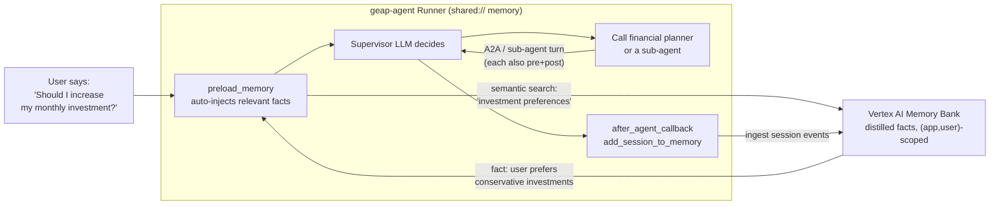

# Learning: Memory Bank from First Principles

A mechanism-level walkthrough of what the Vertex AI Memory Bank is, where it
sits in a request, and why GEAP needs it — built up from first principles,
not as a feature tour. The technical spec lives in
[`MEMORY_BANK.md`](./MEMORY_BANK.md); this doc explains *why* it works the
way it does.

---

## 1. The core problem: LLMs only live for one request

Start with what an LLM actually is. Each call is **stateless**: you send it a
prompt, it returns text, and the moment it returns, it forgets everything.

- **A class library** keeps its data on disk. Come back a year later, the
  data is still there.
- **An LLM** is like a worker who reads a briefing, answers, and throws the
  briefing away. Ask the same worker tomorrow and it has no memory of
  yesterday.

So for an agent to "remember" anything, the memory has to live **outside the
model** and be **put back into the prompt** every time it's needed. That's the
only way the model appears to have memory.

There are three layers of this in ADK, from shortest to longest-lived:

| Layer | Lives | Dies when | Holds |
| --- | --- | --- | --- |
| **Session / State** | in-memory (or Vertex session service) | session ends, process restarts | the current conversation's messages |
| **Artifacts** | GCS / in-memory | deleted | files the agent produced (plans, CSVs) |
| **Long-term memory** (`MemoryService`) | **Vertex AI Memory Bank** | never (until you delete it) | distilled "facts" recalled across sessions |

Memory Bank is the **third** layer: the part that survives across
conversations *and* process restarts. Everything below is about that layer.

---

## 2. What Memory Bank actually is

Vertex AI Memory Bank is a **managed, searchable store of distilled facts** —
not a transcript.

Two behaviors make it different from just saving chat logs:

1. **Generates memories** — it runs an LLM over your conversation, *extracts*
   durable facts, and **consolidates** them (a new fact that overlaps an old
   one merges into the existing memory instead of duplicating it).
2. **Retrieves via semantic search** — you ask for facts "about investment
   preferences" and it returns the *relevant* stored memories as embeddings
   match, not a literal keyword.

> **Why bother distilling instead of storing the raw transcript?**
> A raw transcript is noisy and grows without bound. Distilling to facts keeps
> the stored memory small, deduplicated, and fast to search — so on every
> request the agent only retrieves the handful of facts that matter for *this*
> question, not the entire history.

Memories are scoped by a key pair:

```
(app_name, user_id)
```

GEAP keys every memory by which app produced it and which user said it. Two
users' memories never mix; the local dev app and the deployed app don't bleed
into each other.

---

## 3. The two halves: read path and write path

Every agent in GEAP (the supervisor, its five sub-agents, and the financial
planner) wires memory **twice** — once to read it into a request, once to
write it back after a request.

### Write path — after a turn, persist

Each agent registers an `after_agent_callback`:

```python
# app/app_utils/memory_callbacks.py
async def save_session_to_memory_callback(callback_context):
    await callback_context.add_session_to_memory()
```

And each agent declares it:

```python
# app/agents/portfolio_agent.py
portfolio_agent = LlmAgent(
    ...,
    after_agent_callback=save_session_to_memory_callback,
)
```

> **Why a callback, not manual code?** ADK fires callbacks for you at fixed
> points in every request. By registering one callback in each agent, the
> write happens automatically after every single turn — no per-conversation
> plumbing, no forgotten saves. Same mechanism the framework uses for
> logging/observability.

### Read path — before/as a turn, recall

Each agent gets two built-in ADK tools:

```python
tools=[
    _portfolio_mcp,
    preload_memory,   # runs AUTOMATICALLY at every turn (not model-callable)
    load_memory,      # on-demand, agent chooses to call it
],
```

- **`preload_memory`** — **not a model-callable tool.** ADK executes it at the
  start of every turn: it searches memory using the current user query and
  injects the results as `<PAST_CONVERSATIONS>...</PAST_CONVERSATIONS>` into
  the model's context. No model decision required; the facts are just *there*.
- **`load_memory`** — a real callable tool the model can *decide* to call
  mid-turn when it wants deeper history than `preload_memory` auto-provided.
  It also self-injects an "you can call load_memory if needed" instruction
  each turn, so prompts don't need to mention it.

The `MEMORY:` block only tells the model to *reference* the already-injected
past and to *acknowledge* new facts so they persist:

```
MEMORY:
Relevant <PAST_CONVERSATIONS> from the user's history are injected at the
start of the turn — reference them when they apply. Explicitly acknowledge
new preferences or goals so they persist for future sessions.
```

> **Why two tools?** `preload_memory` guarantees context with zero model
> effort (fast, reliable baseline) — it fires automatically, so the model
> never has to remember to look. `load_memory` lets the model pull *more*,
> deeper facts on demand (flexible, but needs the model to reach for it). One
> guarantees, the other optimizes.

---

## 4. One shared service for every surface

Both tools and the callback don't each build their own connection. There is a
single process-wide service, cached and registered under `shared://` so the
ADK web UI, the A2A path, and the Runner all share it:

```python
# app/app_utils/services.py
@functools.cache
def get_memory_service():
    from google.adk.memory import VertexAiMemoryBankService
    ...
    return VertexAiMemoryBankService(
        project=...,
        location=...,
        agent_engine_id=...,
    )

_registry.register_memory_service("shared", lambda uri, **kw: get_memory_service())
```

> **Why shared, why cached?** Building a cloud client is expensive (auth,
> TLS). One instance created once and reused means a session started on one
> surface is visible on every other surface, and no request pays the cost of a
> fresh connection. `@functools.cache` is the standard-library way to make a
> lazy singleton — no custom factory needed.

---

## 5. The full request flow — end to end

Now put it together. Here is what happens when the user asks a question that
involves memory, e.g. **"Should I increase my monthly investment?"** after
previously saying **"I prefer conservative, low-volatility investments."**



Let's walk it step by step with this example:

1. **Recall (automatic).** `preload_memory` fires at turn start. It searches
   Bank for facts relevant to the question, finds
   *"user prefers conservative, low-volatility investments"* (scoped to the
   current user), and injects it into the model's context *before* the model
   responds.
2. **Reasoning.** The supervisor LLM now sees both the new question *and* the
   remembered preference. It knows the user tends toward conservative
   choices, so it answers in that frame (or delegates to a specialist via
   A2A). The sub-agent turn runs its **own** preload + post steps — memory
   works at every level.
3. **Consolidation.** The model acknowledges any *new* fact it learns this
   turn — "I'll keep your conservative preference in mind" — which tells the
   ingest step this is worth persisting.
4. **Write (automatic).** After the turn, the `after_agent_callback` persists
   the session via `add_session_to_memory`. Memory Bank re-extracts and
   consolidates facts: if the user clarified a new detail, it merges into the
   existing memory rather than stacking a duplicate.

---

## 6. What memory is *not* — honest boundaries

- **Not a session.** Sessions hold the raw conversation; memory holds
  distilled facts. Restart the process, the in-memory session is gone but the
  facts in Bank survive.
- **Not the full transcript.** A long conversation is reduced to its durable
  facts. When you truly want the raw history, that's the session layer, not
  memory.
- **Not instant or guaranteed.** The write is fire-and-forget (async ingest).
  If the API call errors, the callback swallows it — the agent *thinks* it
  saved but nothing was stored. That's why the production checklist in
  `MEMORY_BANK.md` greps logs for `Background ingest_events task failed:`.
- **Scoped, not global.** A `<user_id>` collision leaks memories; a
  throwaway `user_id` in local tests keeps real memory clean.

---

## 7. One more concrete example — across sessions

The clearest proof of value is a question that spans two different
conversations.

**Session A (day 1):**

```text
User:    I prefer conservative investments.
Agent:   Got it — I'll treat that as your default risk preference.
         [preload_memory: nothing yet]
         [after_agent_callback: ingest → Bank stores
           "prefers conservative, low-volatility investments"]
```

**Session B (day 30 — a brand-new conversation):**

```text
User:    Should I move to more aggressive funds?
         [preload_memory: semantic search finds the stored preference]
Agent:   You've told me you prefer conservative, low-volatility
         investments. Aggressive funds would be a shift — want to
         talk through the trade-off? [aware of Session A, despite it
         being a different session entirely]
```

Without Memory Bank, session B would be a stranger fumbling in the dark. With
it, the agent behaves as if it has a persistent memory of its user — because
what makes the model "remember" is *always being handed the right facts back
in its prompt.*

---

## Reference

- Implementation spec & config: [`MEMORY_BANK.md`](./MEMORY_BANK.md)
- Write path: `app/app_utils/memory_callbacks.py` (callback),
  `app/app_utils/services.py` (`get_memory_service`)
- Read path: `preload_memory` / `load_memory` tools + `MEMORY:` prompt blocks
  in `app/agents/*.py` and `app/prompts/*.py`