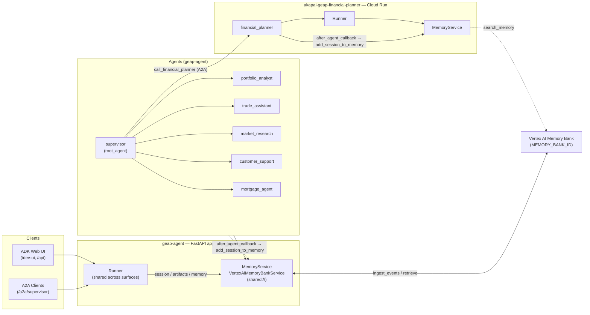

# Long-Term Memory with Vertex AI Memory Bank

This document describes how GEAP agents (the supervisor, its five sub-agents,
and the financial planner) use **Vertex AI Memory Bank** for long-term,
cross-session memory via the ADK `MemoryService` abstraction.

## Overview

ADK's `MemoryService` gives agents a searchable, persistent knowledge store that
survives individual sessions:

- **Session / State** — short-term memory for one conversation.
- **Long-Term Memory (`MemoryService`)** — a persistent archive the agent can
  consult across conversations, keyed by `(app_name, user_id)`.

GEAP uses the [`VertexAiMemoryBankService`](https://adk.dev/sessions/memory/#memory-bank),
a fully-managed Google Cloud service that:

- **Generates memories** from conversation events (LLM-extracted, with
  consolidation so new facts merge with existing related memories).
- **Retrieves memories** via semantic search.

## Architecture

Both repositories implement the same pattern:

| Repo | Agents |
| --- | --- |
| `akapal-geap-agent` | `supervisor`, `portfolio_analyst`, `trade_assistant`, `market_research`, `customer_support`, `mortgage_agent` |
| `akapal-geap-financial-planner` | `financial_planner` |

### Diagram



Read path (dotted): each agent uses `preload_memory` (automatic at turn start)
and `load_memory` (on-demand) — both go through the Runner's
`MemoryService.search_memory`. Write path (solid): after every agent turn, the
`after_agent_callback` persists the session via
`MemoryService.add_session_to_memory`. All memories are scoped by
`(app_name, user_id)`.

### Read path

Every agent is given two built-in ADK tools:

- `preload_memory` — **runs automatically** (it is not a model-callable tool;
  ADK executes it at the start of every turn), searches memory using the
  current user query, and injects the results as
  `<PAST_CONVERSATIONS>` into the model's context (baseline user context).
- `load_memory` — a real callable tool the agent decides to invoke on-demand
  when it wants more history than `preload_memory` auto-provided. It also
  self-injects its own "call load_memory if needed" instruction, so prompts do
  not need to mention it.

Each prompt's `MEMORY:` block tells the agent to reference the auto-injected
`<PAST_CONVERSATIONS>` and to acknowledge new preferences/goals so they
persist — it no longer tells the agent to call `load_memory` at turn start
(that is redundant with `preload_memory`).

### Write path

Every agent registers `after_agent_callback=save_session_to_memory_callback`
(defined in `app/app_utils/memory_callbacks.py`). After each agent turn, the
callback persists the session to Memory Bank via
`callback_context.add_session_to_memory()`.

### Service wiring

`app/app_utils/services.py` exposes a process-wide, cached
`get_memory_service()`:

```python
@functools.cache
def get_memory_service():
    """Process-wide Vertex AI Memory Bank service shared across serving surfaces."""
    from google.adk.memory import VertexAiMemoryBankService

    project = os.environ.get("GOOGLE_CLOUD_PROJECT")
    location = os.environ.get("GOOGLE_CLOUD_AGENT_ENGINE_LOCATION") or os.environ.get(
        "GOOGLE_CLOUD_LOCATION"
    )
    agent_engine_id = os.environ.get(
        "MEMORY_BANK_ID",
        os.environ.get("GOOGLE_CLOUD_AGENT_ENGINE_ID"),
    )
    logger.info(
        "memory backend: vertex-ai-memory-bank (project=%s location=%s engine=%s)",
        project,
        location,
        agent_engine_id,
    )
    return VertexAiMemoryBankService(
        project=project,
        location=location,
        agent_engine_id=agent_engine_id,
    )
```

- `MEMORY_BANK_ID` selects the Memory Bank instance; falls back to the
  runtime-injected `GOOGLE_CLOUD_AGENT_ENGINE_ID` when unset.
- The service is registered under `shared://` in the service registry, so the
  ADK web routes, the A2A path, and the Runner share one instance.
- It **fails fast** (raises `ValueError`) if no instance ID is configured,
  rather than silently degrading.

The service is passed to the `Runner` in each repo's `fast_api_app.py`:

```python
runner = Runner(
    agent=root_agent,
    app_name=root_agent.name,
    session_service=services.get_session_service(),
    artifact_service=services.get_artifact_service(),
    memory_service=services.get_memory_service(),
    auto_create_session=True,
)
```

### Files changed

| File (both repos) | Purpose |
| --- | --- |
| `app/app_utils/services.py` | Added `get_memory_service()` + `shared://` registration |
| `app/app_utils/memory_callbacks.py` | New: `save_session_to_memory_callback` |
| `app/agents/*.py` | Added `preload_memory`, `load_memory` tools + `after_agent_callback` |
| `app/prompts/*.py` | Added `MEMORY:` instruction block |
| `app/fast_api_app.py` | Passed `memory_service` to the `Runner` |
| `geap.deploy.env` / `deploy.personal.env` | Added `MEMORY_BANK_ID` |

## Configuration

| Env var | Default | Purpose |
| --- | --- | --- |
| `GOOGLE_CLOUD_PROJECT` | — | GCP project hosting the Memory Bank |
| `GOOGLE_CLOUD_LOCATION` | — | Region of the Memory Bank (unless `GOOGLE_CLOUD_AGENT_ENGINE_LOCATION` is set) |
| `GOOGLE_CLOUD_AGENT_ENGINE_LOCATION` | `GOOGLE_CLOUD_LOCATION` | Region of the runtime's Memory Bank |
| `MEMORY_BANK_ID` | `GOOGLE_CLOUD_AGENT_ENGINE_ID` | Memory Bank instance ID (e.g. `456` in `projects/.../reasoningEngines/456`) |

## Prerequisites

Before Memory Bank works, you need:

1. **Agent Platform API enabled** on the Google Cloud project.
2. **A Memory Bank instance** (an Agent Runtime / reasoning engine). When
   deployed via Agent Runtime, the runtime's built-in Memory Bank is used
   automatically (`MEMORY_BANK_ID` unset → engine ID). To use a dedicated
   instance, create one and set `MEMORY_BANK_ID` to its numeric ID.
3. **Authentication**:
   - Local: `gcloud auth application-default login`.
   - Deployed: the runtime's service identity.
4. **Dependencies** — already satisfied by `google-cloud-aiplatform[agent_engines,adk]`
   in `pyproject.toml` (no new dependencies).

## Verification

Automated:

```bash
python -m compileall app
python -c "from app.agents.supervisor import root_agent; print(root_agent.name)"
```

Each agent's canonical tools include `preload_memory` and `load_memory` exactly
once, with no duplicate tool names.

### Local (requires a Memory Bank instance + ADC)

1. `gcloud auth application-default login`; set `GOOGLE_CLOUD_PROJECT`,
   `GOOGLE_CLOUD_LOCATION`, `MEMORY_BANK_ID`.
2. Start the app; startup log shows
   `memory backend: vertex-ai-memory-bank`.
3. Session A: "I prefer conservative investments." Finish.
4. New Session B: "What are my investment preferences?" — the agent answers
   from memory (proves write + read end-to-end).

### Deployed — 4-step checklist

1. **Wiring** — `MEMORY_BANK_ID` set (or engine ID injected); startup log
   confirms the backend; Cloud Logging shows `Ingest events request triggered.`
   after a turn.
2. **Cross-session recall** — Session A states a preference; a new Session B
   asks for it and the agent answers from memory.
3. **Direct bank query** (isolates agent vs bank):

   ```python
   import vertexai

   client = vertexai.Client(project="PROJECT_ID", location="LOCATION")
   result = client.agent_engines.memories.retrieve(
       name="reasoningEngines/<AGENT_ENGINE_ID>",
       scope={"app_name": "<APP_NAME>", "user_id": "<USER_ID>"},
       similarity_search_params={"search_query": "investment preferences"},
   )
   async for r in result:
       print(r.memory.fact)
   ```

4. **Silent-failure check** — grep Cloud Logging for
   `Background ingest_events task failed:` (must be absent after a test turn).
   Ingestion is fire-and-forget; this catches the case where the agent thinks
   it saved but the API call actually errored.

## Notes / trade-offs

- **Scope** — memories are isolated by `(app_name, user_id)`. Use a throwaway
  `user_id`/`app_name` locally so test conversations don't pollute real memory.
- **`add_session_to_memory` vs `add_events_to_memory`** — the implementation
  persists the whole session (one line, matches the Dev Signal blog pattern).
  For long sessions the official quickstart recommends incremental event
  ingestion (`events[-5:-1]`) to avoid reprocessing; upgrade path noted here.
- **Memory Bank only, no in-memory fallback** — chosen for determinism (prod
  and local behave identically). Local dev requires a Memory Bank instance.

## References

- [ADK Memory docs](https://adk.dev/sessions/memory/)
- [Memory Bank quickstart with ADK](https://docs.cloud.google.com/gemini-enterprise-agent-platform/scale/memory-bank/adk-quickstart)
- [Dev Signal multi-agent + memory blog](https://cloud.google.com/blog/topics/developers-practitioners/multi-agent-architecture-and-long-term-memory-with-adk-mcp-and-cloud-run)
- [Memory Bank overview](https://docs.cloud.google.com/gemini-enterprise-agent-platform/scale/memory-bank)
