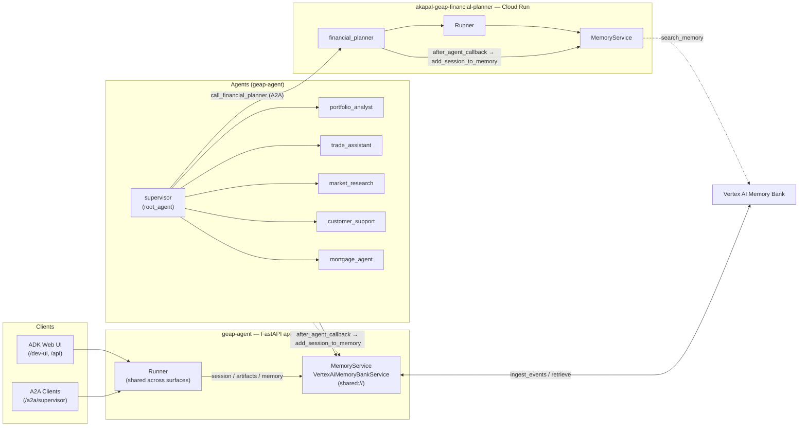

# Long-Term Memory with Vertex AI Memory Bank

This document describes how GEAP agents (the supervisor, its five sub-agents,
and the financial planner) use **Vertex AI Memory Bank** for long-term,
cross-session memory via the ADK `MemoryService` abstraction.

## Overview

ADK's `MemoryService` gives agents a searchable, persistent knowledge store that
survives individual sessions:

- **Session / State** — short-term memory for one conversation.
- **Long-Term Memory (`MemoryService`)** — a persistent archive the agent can
  consult across conversations, keyed by `(app_name, user_id)`.

GEAP uses the [`VertexAiMemoryBankService`](https://adk.dev/sessions/memory/#memory-bank),
a fully-managed Google Cloud service that:

- **Generates memories** from conversation events (LLM-extracted, with
  consolidation so new facts merge with existing related memories).
- **Retrieves memories** via semantic search.

## Architecture

Both repositories implement the same pattern:

| Repo | Agents |
| --- | --- |
| `akapal-geap-agent` | `supervisor`, `portfolio_analyst`, `trade_assistant`, `market_research`, `customer_support`, `mortgage_agent` |
| `akapal-geap-financial-planner` | `financial_planner` |

### Diagram



Read path (dotted): each agent uses `preload_memory` (automatic at turn start)
and `load_memory` (on-demand) — both go through the Runner's
`MemoryService.search_memory`. Write path (solid): after every agent turn, the
`after_agent_callback` persists the session via
`MemoryService.add_session_to_memory`. All memories are scoped by
`(app_name, user_id)`.

### Read path

Every agent is given two built-in ADK tools:

- `preload_memory` — **runs automatically** (it is not a model-callable tool;
  ADK executes it at the start of every turn), searches memory using the
  current user query, and injects the results as
  `<PAST_CONVERSATIONS>` into the model's context (baseline user context).
- `load_memory` — a real callable tool the agent decides to invoke on-demand
  when it wants more history than `preload_memory` auto-provided. It also
  self-injects its own "call load_memory if needed" instruction, so prompts do
  not need to mention it.

Each prompt's `MEMORY:` block tells the agent to reference the auto-injected
`<PAST_CONVERSATIONS>` and to acknowledge new preferences/goals so they
persist — it no longer tells the agent to call `load_memory` at turn start
(that is redundant with `preload_memory`).

### Write path

Every agent registers `after_agent_callback=save_session_to_memory_callback`
(defined in `app/app_utils/memory_callbacks.py`). After each agent turn, the
callback persists the session to Memory Bank via
`callback_context.add_session_to_memory()`.

### Service wiring

`AdkApp.set_up()` builds the memory service for us. Once the platform injects
`GOOGLE_CLOUD_AGENT_ENGINE_ID`, it constructs a `VertexAiMemoryBankService`
against that engine's Memory Bank; with no engine ID (local runs) it falls back
to `InMemoryMemoryService`:

```python
# vertexai/agent_engines/templates/adk.py, AdkApp.set_up()
elif "GOOGLE_CLOUD_AGENT_ENGINE_ID" in os.environ:
    self._tmpl_attrs["memory_service"] = VertexAiMemoryBankService(
        project=project,
        location=agent_engine_location,
        agent_engine_id=os.environ.get("GOOGLE_CLOUD_AGENT_ENGINE_ID"),
    )
else:
    self._tmpl_attrs["memory_service"] = InMemoryMemoryService()
```

The template hands that same instance to the `Runner` it builds, which is what
makes `callback_context.add_session_to_memory()` (the write path above) and
`preload_memory` / `load_memory` (the read path) work.

To point at a *dedicated* Memory Bank instance instead of the runtime's own, pass
a `memory_service_builder` to `AdkApp` in `deploy_adk.py`:

```python
app = AdkApp(agent=root_agent, memory_service_builder=my_memory_service_builder)
```

> **Historical:** `app/app_utils/services.py` used to do this with a
> `shared://memory` registry entry, selected from the FastAPI app via
> `memory_service_uri`. Both that module and the `MEMORY_BANK_ID` env var were
> removed when the supervisor moved to an `AdkApp` object deploy — the
> template's default already matches what the registry did.

**The planner repo** has no `AdkApp` on its A2A path, so it still builds the
memory service itself and passes it to a `Runner`:

```python
runner = Runner(
    agent=root_agent,
    app_name=root_agent.name,
    session_service=services.get_session_service(),
    artifact_service=services.get_artifact_service(),
    memory_service=services.get_memory_service(),
    auto_create_session=True,
)
```

### Files changed

| File | Purpose |
| --- | --- |
| `app/app_utils/memory_callbacks.py` | `save_session_to_memory_callback` |
| `app/agents/*.py` | Added `preload_memory`, `load_memory` tools + `after_agent_callback` |
| `app/prompts/*.py` | Added `MEMORY:` instruction block |
| `deploy_adk.py` | `AdkApp` — supplies the Memory Bank service by default (this repo) |

## Configuration

| Env var | Default | Purpose |
| --- | --- | --- |
| `GOOGLE_CLOUD_PROJECT` | — | GCP project hosting the Memory Bank |
| `GOOGLE_CLOUD_LOCATION` | — | Region of the Memory Bank (unless `GOOGLE_CLOUD_AGENT_ENGINE_LOCATION` is set) |
| `GOOGLE_CLOUD_AGENT_ENGINE_ID` | — | Runtime-injected. Selects the Memory Bank instance |
| `GOOGLE_CLOUD_AGENT_ENGINE_LOCATION` | `GOOGLE_CLOUD_LOCATION` | Region of the runtime's Memory Bank |

## Prerequisites

Before Memory Bank works, you need:

1. **Agent Platform API enabled** on the Google Cloud project.
2. **A Memory Bank instance** (an Agent Runtime / reasoning engine). The
   runtime's built-in Memory Bank is used automatically once
   `GOOGLE_CLOUD_AGENT_ENGINE_ID` is injected. To use a *dedicated* instance
   instead, pass a `memory_service_builder` to `AdkApp`.
3. **Authentication**:
   - Local: `gcloud auth application-default login`.
   - Deployed: the runtime's service identity.
4. **Dependencies** — already satisfied by `google-cloud-aiplatform[agent_engines,adk]`
   in `pyproject.toml` (no new dependencies).

## Verification

Automated:

```bash
python -m compileall app
python -c "from app.agents.supervisor import root_agent; print(root_agent.name)"
```

Each agent's canonical tools include `preload_memory` and `load_memory` exactly
once, with no duplicate tool names.

### Local (requires a Memory Bank instance + ADC)

A local run has no `GOOGLE_CLOUD_AGENT_ENGINE_ID`, so `AdkApp` uses in-memory
memory and cross-session recall cannot be exercised. To point a local run at a
real Memory Bank, export `GOOGLE_CLOUD_AGENT_ENGINE_ID` (and
`GOOGLE_CLOUD_PROJECT` / `GOOGLE_CLOUD_LOCATION`) so `AdkApp.set_up()` builds the
`VertexAiMemoryBankService`, then:

1. Session A: "I prefer conservative investments." Finish.
2. New Session B: "What are my investment preferences?" — the agent answers
   from memory (proves write + read end-to-end).

### Deployed — 4-step checklist

1. **Wiring** — `GOOGLE_CLOUD_AGENT_ENGINE_ID` is injected by the runtime, so
   `AdkApp.set_up()` builds the `VertexAiMemoryBankService`; Cloud Logging shows
   `Ingest events request triggered.` after a turn.
2. **Cross-session recall** — Session A states a preference; a new Session B
   asks for it and the agent answers from memory.
3. **Direct bank query** (isolates agent vs bank):

   ```python
   import vertexai

   client = vertexai.Client(project="PROJECT_ID", location="LOCATION")
   result = client.agent_engines.memories.retrieve(
       name="reasoningEngines/<AGENT_ENGINE_ID>",
       scope={"app_name": "<APP_NAME>", "user_id": "<USER_ID>"},
       similarity_search_params={"search_query": "investment preferences"},
   )
   async for r in result:
       print(r.memory.fact)
   ```

4. **Silent-failure check** — grep Cloud Logging for
   `Background ingest_events task failed:` (must be absent after a test turn).
   Ingestion is fire-and-forget; this catches the case where the agent thinks
   it saved but the API call actually errored.

## Notes / trade-offs

- **Scope** — memories are isolated by `(app_name, user_id)`. Use a throwaway
  `user_id`/`app_name` locally so test conversations don't pollute real memory.
- **`add_session_to_memory` vs `add_events_to_memory`** — the implementation
  persists the whole session (one line, matches the Dev Signal blog pattern).
  For long sessions the official quickstart recommends incremental event
  ingestion (`events[-5:-1]`) to avoid reprocessing; upgrade path noted here.
- **Memory Bank only, no in-memory fallback** — chosen for determinism (prod
  and local behave identically). Local dev requires a Memory Bank instance.

## References

- [ADK Memory docs](https://adk.dev/sessions/memory/)
- [Memory Bank quickstart with ADK](https://docs.cloud.google.com/gemini-enterprise-agent-platform/scale/memory-bank/adk-quickstart)
- [Dev Signal multi-agent + memory blog](https://cloud.google.com/blog/topics/developers-practitioners/multi-agent-architecture-and-long-term-memory-with-adk-mcp-and-cloud-run)
- [Memory Bank overview](https://docs.cloud.google.com/gemini-enterprise-agent-platform/scale/memory-bank)
