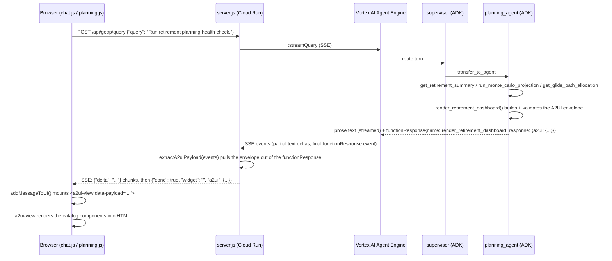

# A2UI in GEAP — How It's Implemented

How the retirement planning dashboard goes from a GEAP agent's tool call to a rendered
widget in the browser, using [A2UI](https://developers.googleblog.com/a2ui-v0-9-generative-ui/)
(Agent-to-UI) — Google's spec for agents that hand a client a declarative UI description
instead of only prose, so the client renders it with its *own* component catalog rather
than a bundled widget library.

This doc covers the whole path across both repos. For the backend-only details (Python
API, validation, model choice), see [`geap-agent/docs/A2UI.md`](../../geap-agent/docs/A2UI.md).

## Why a custom (not reference-SDK) implementation

The reference A2UI SDKs teach an LLM to hand-author the envelope JSON in free text, wrapped
in `<a2ui-json>` tags, then parse/heal/validate whatever comes back. GEAP does something
narrower and more reliable: **the JSON is never LLM-authored**. An agent's tool builds the
envelope with plain, deterministic Python
(`geap-agent/app/a2ui/envelope.py::SurfaceBuilder`) and hands it back through ADK's normal
function-calling mechanism — the same mechanism `trade_assistant` already used for
`show_rebalance_widget` before this feature existed. The model's only job is deciding
*when* to call the tool; it never touches the JSON.

Trade-off, stated plainly: this project's agents can't freely improvise arbitrary new UI
layouts token-by-token the way the reference SDK's healing parser allows. What we get in
return is JSON that is *always* well-formed and catalog-valid — no malformed-payload risk
reaching the browser — which matters more for a fiduciary-adjacent, compliance-flagged
surface like retirement planning than improvisational flexibility does. The wire format
(the envelope itself — `createSurface` / `updateComponents` / `updateDataModel` /
`deleteSurface`, a catalog of named component types) is the real A2UI contract; only *how
the server assembles it* differs from the reference SDKs.

## Request flow



Two entry points reach the same agent and the same envelope shape:

- **Chat window** (`chat.js`): a retirement-related message is routed by `supervisor` to
  `planning_agent` like any other query; the `done` SSE event's `a2ui` field is mounted as
  an `<a2ui-view>` node in the message bubble.
- **`/planning` page** (`planning.js`): on mount, `mountPlanningDashboard()` calls the same
  `/api/geap/query` endpoint via `GeapApp.queryA2ui()` (a buffered, non-streaming variant of
  the same call chat.js makes) and feeds the one envelope it gets back into three
  `<a2ui-view>` mounts (`data-root="stats"`, `"tools"`, `"safeguards"`) — so the page and the
  chat widget share one implementation instead of two hardcoded copies of the same numbers.

## The envelope

Four message types, matching the real A2UI spec:

| Type | Carries |
|---|---|
| `createSurface` | `surfaceId`, `root` (the id of the top-level component) |
| `updateComponents` | The full component list for this surface: `{id, type, props, children}` each |
| `updateDataModel` | Free-form bound data (`agent`, `glidePathAllocation`, ...) |
| `deleteSurface` | Clears a surface (built for forward-compat; no GEAP tool emits it yet) |

Every GEAP tool today sends exactly one `createSurface` + one `updateComponents` + one
`updateDataModel` message per call — a complete snapshot, not an incremental diff. The
client-side reducer (`reduceEnvelope` in `a2ui-view.js`) still folds messages in order
rather than assuming exactly three, so a future truly-incremental agent doesn't require a
renderer rewrite.

Abbreviated real example (see `app/tools/planning/retirement_tools.py` for the full one):

```json
{
  "version": "a2ui/0.9",
  "catalogId": "geap.planning.v1",
  "messages": [
    { "type": "createSurface", "surfaceId": "retirement-dashboard", "root": "root" },
    {
      "type": "updateComponents",
      "surfaceId": "retirement-dashboard",
      "components": [
        { "id": "root", "type": "surface", "props": { "title": "GEAP Intelligent Retirement Advisor" }, "children": ["hero", "stats", "tools", "safeguards"] },
        { "id": "stat-savings", "type": "stat_tile", "props": { "label": "Retirement Savings", "value": "$84,230.15" }, "children": [] }
      ]
    },
    { "type": "updateDataModel", "surfaceId": "retirement-dashboard", "data": { "agent": "planning_agent" } }
  ]
}
```

## Client-side architecture — Lit web components

The browser-side renderer is built with [Lit](https://lit.dev/) v3 (loaded via import map,
no bundler required). Each catalog type maps 1:1 to a Lit `LitElement`:

```
public/js/a2ui/
  a2ui-view.js              ← <a2ui-view> compositor (Lit entry point)
  a2ui-utils.js             ← pure utilities: reduceEnvelope, encodePayload, decodePayload (UMD, Node.js-friendly for tests)
  components/
    a2ui-surface.js
    a2ui-hero-cta.js
    a2ui-stat-grid.js
    a2ui-stat-tile.js
    a2ui-tool-grid.js
    a2ui-tool-card.js
    a2ui-safeguard-panel.js
    a2ui-safeguard-row.js
```

`a2ui-view.js` imports all eight component modules, then uses `LitElement.render()` to
build a tree of those custom elements from the decoded envelope. All prop values are passed
via Lit property bindings (`.propName=${value}`) — Lit sets the DOM property directly,
bypassing HTML attribute serialisation, so all values are safe regardless of content
(Lit's own security model).

All components use **light DOM** (`createRenderRoot() { return this; }`) so the app's
existing design tokens and global CSS rules in `a2ui.css` and `styles.css` remain in scope
without Shadow DOM piercing.

The `a2ui-utils.js` module exposes the pure envelope utilities (`reduceEnvelope`,
`encodePayload`, `decodePayload`, `CATALOG_TYPES`) as a UMD bundle, so Node.js unit tests
can require it without a DOM or Lit dependency.

## The catalog

One vocabulary, defined once, referenced from both repos — this is the actual contract;
everything else is plumbing around it.

| Type | Lit element | Renders as | Styles |
|---|---|---|---|
| `surface` | `<a2ui-surface>` | Root wrapper, optional title/subtitle | `.a2ui-surface` |
| `hero_cta` | `<a2ui-hero-cta>` | Purple gradient hero card | `.a2ui-hero` |
| `stat_grid` | `<a2ui-stat-grid>` | Responsive grid of `stat_tile` | `.planning-stats-grid` |
| `stat_tile` | `<a2ui-stat-tile>` | One labeled metric | `.geap-stat-card`, `.a2ui-stat-tile` |
| `tool_grid` | `<a2ui-tool-grid>` | Responsive grid of `tool_card` | `.planning-tools-grid` |
| `tool_card` | `<a2ui-tool-card>` | Icon + title + body | `.geap-stat-card`, `.a2ui-tool-card` |
| `safeguard_panel` | `<a2ui-safeguard-panel>` | Card listing `safeguard_row` children | `.a2ui-safeguard-panel` |
| `safeguard_row` | `<a2ui-safeguard-row>` | One safeguard, active/inactive dot | `.a2ui-safeguard-row` |
| `chart_tabs` | `<a2ui-chart-tabs>` | Tabbed switcher over chart children (e.g. glide path / Monte Carlo / allocation) | `.a2ui-chart-tabs` |
| `glide_path_chart` | `<a2ui-glide-path-chart>` | Stacked-area equities/bonds/cash mix by age | `.a2ui-glide-path-chart`, `.a2ui-chart-*` |
| `monte_carlo_chart` | `<a2ui-monte-carlo-chart>` | p10/p50/p90 wealth projection fan chart vs. a target | `.a2ui-monte-carlo-chart`, `.a2ui-chart-*` |
| `allocation_chart` | `<a2ui-allocation-chart>` | Segmented allocation bar + legend | `.a2ui-allocation-chart`, `.a2ui-chart-*` |

The four chart types replace what used to be a single hand-authored SVG string in
chat.js's `getRetirementWidgetHtml()`/`switchRetirementChartTab()` (hardcoded demo numbers,
global `onclick` handlers, `outerHTML` swaps). Each chart is now a plain data-driven Lit
element — feed it `points`/`segments` props and it renders any dataset, not just the one
demo shape — and `chart_tabs` owns tab-switching internally as component state instead of a
global function, so the same building blocks are reusable by any future tool (Monte Carlo
standalone, tax-loss harvesting, etc.) that needs a tabbed set of visualizations.

Source of truth: [`geap-agent/app/a2ui/catalog.py`](../../geap-agent/app/a2ui/catalog.py)
(`COMPONENT_TYPES`). The `TYPE_RENDERERS` map in `a2ui-view.js` and the `CATALOG_TYPES`
array in `a2ui-utils.js` must both stay in sync with it — kept in sync by hand today (see
**Limitations** below). Validation catches drift server-side immediately (a tool call fails
loudly); the browser-side fallback degrades gracefully (renders children only) rather than
breaking.

Deliberately reuses this app's own CSS classes/design tokens (`--geap-*`, `.geap-stat-card`,
`.planning-stats-grid`, `.geap-badge`) rather than inventing a parallel style system — the
core A2UI principle that an agent should speak the client's existing design language, not
ship its own.

## Adding a new A2UI surface

1. **Backend**: add component types to `app/a2ui/catalog.py` if the new surface needs types
   the existing eight don't cover. Add mock data functions + a `render_<name>()` tool
   (model on `app/tools/planning/retirement_tools.py`) that builds the envelope with
   `SurfaceBuilder` and calls `validate_envelope()` before returning `{"a2ui": envelope}`.
2. **Agent**: wire the new tool into an `LlmAgent` (existing or new), and if new, register it
   in `app/agents/supervisor.py`'s routing map and `sub_agents` list.
3. **Server relay**: add the tool's name to `A2UI_SIGNAL_TOOLS` in `server.js` so
   `extractA2uiPayload()` picks up its `functionResponse`.
4. **Client**:
   a. Create `public/js/a2ui/components/a2ui-<type>.js` — a `LitElement` with `@property()`
      for each prop. Import it in `a2ui-view.js` and add a type renderer to `TYPE_RENDERERS`.
   b. Add the type to `CATALOG_TYPES` in `a2ui-utils.js`.
   c. Add CSS to `public/css/a2ui.css` for the new component's light-DOM styles.
   d. Mount `<a2ui-view>` wherever the surface should appear — `.payload = envelope` (JS
      property) or `data-payload="<base64 JSON>"` (`A2uiView.encodePayload()`) for
      string-templated HTML.

## Model selection

`planning_agent` runs on the same flash-tier `DEFAULT_MODEL` every other GEAP agent uses
(see `app/config/models.py` in the `geap-agent` repo). It can be pinned to a different
model via the `PLANNING_AGENT_MODEL` env var (→ falls back to `AGENT_MODEL` → default) if
this agent's longer tool-call chains (including the dashboard tool) for a
compliance-flagged surface ever need a stronger model.

## Validation / safety net

1. **Structural**: `jsonschema` checks message shape (`app/a2ui/validate.py`).
2. **Semantic**: component types are known-catalog types, `children` references resolve,
   ids are unique, exactly one surface per envelope, a `root` component exists.
3. **Client defensive fallback**: an unrecognized component `type` reaching the browser
   (e.g. a catalog that drifted) renders its children only, with a `console.warn`, instead
   of throwing or blanking the whole surface.

All component `props` values that appear in text positions in Lit `html\`\`` templates are
automatically escaped by Lit's template engine — untrusted text in a `label`/`body`/etc.
cannot inject markup.

## Tests

| File | Covers |
|---|---|
| `geap-agent/tests/unit/test_a2ui.py` | `SurfaceBuilder`, `validate_envelope` |
| `geap-agent/tests/unit/test_planning_tools.py` | Retirement mock data, `render_retirement_dashboard` |
| `geap-agent/tests/unit/test_agent.py` | `planning_agent` registered on the supervisor, model override resolves |
| `tests/unit/geap-stream.test.js` | `extractA2uiPayload` (server.js relay) |
| `tests/unit/a2ui-view.test.js` | `a2ui-utils.js`: `encodePayload`/`decodePayload`, `reduceEnvelope`, full catalog coverage |
| `tests/unit/chat.test.js` | End-to-end mocked turn: SSE → `<a2ui-view>` mounted in a message bubble |
| `tests/unit/portfolios.test.js` | `renderPlanning()` mounts the three `<a2ui-view>` placeholders |

## Known limitations / deliberate simplifications

- **One catalog, one surface** (`geap.planning.v1`, retirement dashboard only) — the code is
  structured so a second surface adds its own component types without touching the first,
  but only one exists today.
- **No incremental component streaming.** Real A2UI implementations can stream partial
  components as the model generates them; GEAP always sends one complete envelope at the
  end of a tool call. The renderer's message-folding logic doesn't assume this, so it isn't
  a rewrite to add later — just no agent produces it yet.
- **Catalog sync is manual.** `app/a2ui/catalog.py` (Python), the `TYPE_RENDERERS` map in
  `a2ui-view.js`, and the `CATALOG_TYPES` array in `a2ui-utils.js` live in two separate
  repos with no shared build step. Validation catches drift server-side immediately (a tool
  call fails loudly); the browser-side fallback degrades gracefully (renders children only)
  rather than breaking. If this grows past one surface, consider generating one side from
  the other or publishing the catalog as JSON both repos fetch from a single source.
- **`GeapApp.queryA2ui()` duplicates chat.js's SSE-parsing loop** in a buffered form (needed
  because `planning.js` doesn't want live token-by-token UI updates for a background
  dashboard fetch). Small, contained duplication; worth collapsing into one shared helper if
  a third caller shows up.
