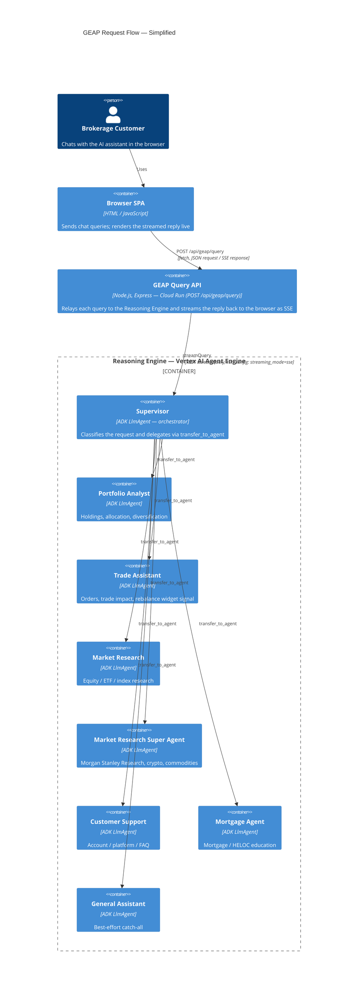
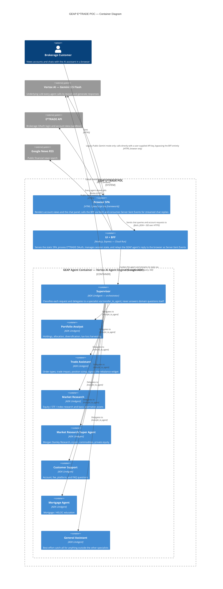

# GEAP E*TRADE POC — Architecture

C4 model, Container level (C4 Level 2). Rendered with [Mermaid](https://mermaid.js.org/)'s
native `C4Container` diagram type, which GitHub renders directly in Markdown — no external
tooling needed to view this file on github.com.

## GEAP Request Flow (simplified)

The primary path through the system, with the OAuth/news integrations and the legacy
Gemini bypass left out so the agent flow itself is easy to follow: **Browser → Cloud Run
query API → Reasoning Engine (Supervisor + specialist sub-agents)**.

## Full Container Diagram (with auxiliary systems)

The complete picture, including the E*TRADE OAuth proxy, the public news search, and the
legacy direct-to-Gemini bypass path alongside the GEAP flow above.

## Request Flow (GEAP mode — the default)

1. **Browser SPA** (`geap-poc/public/js/chat.js`) sends the user's message to `POST /api/geap/query` on the **UI + BFF**.
2. The BFF (`geap-poc/server.js`) reuses or creates a Vertex AI Agent Engine session (`getOrCreateGeapSession`, cached in `req.session.geapSessionId` for conversation memory across turns), then calls the Agent Engine's `:streamQuery` REST method with `run_config: { streaming_mode: "sse" }`.
3. The **GEAP Agent Container** — an ADK app deployed to Vertex AI Agent Engine (`geap-agent/app/agent.py` → `app/agents/supervisor.py`) — runs the **Supervisor**, which classifies the request and delegates to exactly one specialist sub-agent via ADK's `transfer_to_agent` mechanism (itself a real model call).
4. The chosen specialist calls its own tools (e.g. `get_portfolio_holdings`, `get_quote`, `preview_order_impact`) against mock brokerage data, then generates the reply. `trade_assistant` may also call `show_rebalance_widget`, a no-op signal tool with no payload of its own — the client already has everything it needs locally to render that widget.
5. Vertex AI streams events back to the BFF as they're generated (`event.partial` chunks). The BFF's incremental parser (`createIncrementalGeapEventParser`) and delta planner (`createStreamDeltaPlanner`) forward each text delta immediately as an SSE frame — not buffered lump-sum -- and append a `[[WIDGET:REBALANCE_FORM]]` sentinel at the end if the widget-signal tool was called.
6. The SPA reads that SSE stream and updates the chat bubble live as text arrives, then renders the matching widget when the sentinel appears.

## Legacy Public Gemini mode

An alternate, non-default mode (`state.aiSettings.assistantMode === 'gemini'`, toggled in AI Settings) makes the **Browser SPA** call the Gemini API directly with a user-supplied API key (`geap-poc/public/js/gemini.js`), bypassing the BFF and the GEAP Agent Container entirely. It exists for testing outside the hosted multi-agent system and is not part of the primary GEAP request flow above.

## Key facts this diagram reflects

- **Container, not microservice, granularity for the agents**: each specialist is a distinct ADK `LlmAgent` (a real model, its own tools, its own instruction), but all of them are deployed together as one Agent Engine resource — hence one `Container_Boundary`, not one box per agent, at the system level.
- **Every agent hop is a real Gemini call**, including the Supervisor's routing decision — there is no "free" classification step.
- **Session continuity** lives in the BFF (`req.session.geapSessionId`), backed by Vertex AI's own managed `VertexAiSessionService` when deployed as an Agent Engine — not an in-memory store, so it's safe under horizontal scaling.
- **Mock data only**: all account/portfolio/quote data comes from `StaticBrokerageService` in `geap-agent`, explicitly documented as a placeholder until a real E*TRADE integration exists.
